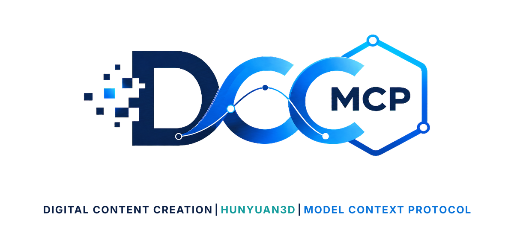
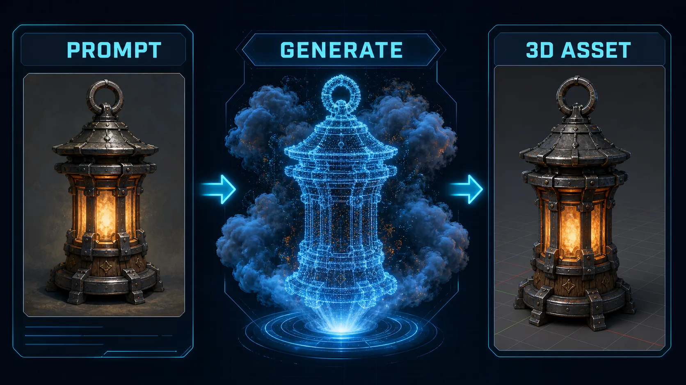

# DCC-MCP Hunyuan3D

<p align="center">
  
</p>

## Agent workflow

AI agents should use installed package skills through the shared gateway. IDE
users may continue to use the MCP endpoint.

```bash
dcc-mcp-cli dcc-types
dcc-mcp-cli list
dcc-mcp-cli search --query "<task>" --dcc-type <host>
dcc-mcp-cli describe <tool-slug>
dcc-mcp-cli call <tool-slug> --json '{"key":"value"}'
```

If the package skill is not active, call
`dcc-mcp-cli load-skill <skill-name> --dcc-type <host>`. After the task,
query `dcc-mcp-cli stats --range 24h --session-id <task-id>` and pass only
bounded evidence to the `review_skill_improvement` prompt from
`dcc-mcp-skills-creator`.




Tencent Cloud Hunyuan 3D generation tools for DCC-MCP.

This skill is intentionally a thin wrapper around Tencent Cloud CLI. Configure
`tccli` and Tencent Cloud credentials in the runtime environment, then submit
and query Hunyuan 3D jobs from any DCC-MCP host.

## Install

```bash
dcc-mcp-cli marketplace add dcc-mcp/dcc-ai-hunyuan3d
dcc-mcp-cli marketplace install dcc-ai-hunyuan3d
```

## Requirements

- `tccli`
- Tencent Cloud credentials configured for `tccli`
- `TENCENTCLOUD_REGION`, or pass `region` per call

## Tools

- `submit_hunyuan3d_job`
- `query_hunyuan3d_job`
