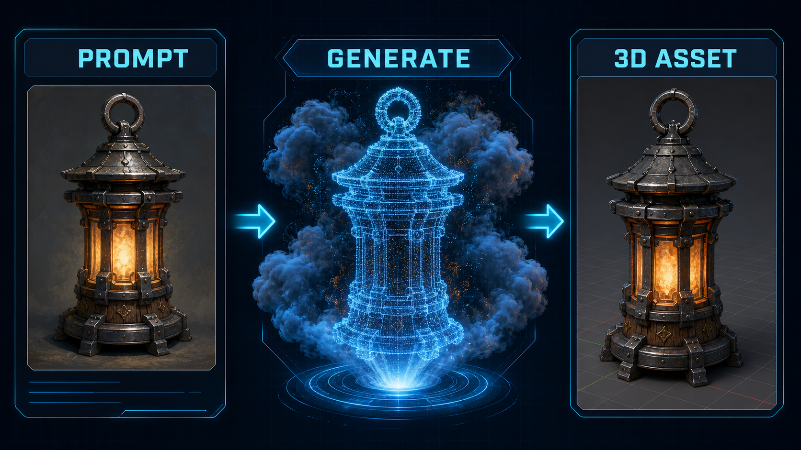

# DCC-MCP Hunyuan3D



Tencent Cloud Hunyuan 3D generation tools for DCC-MCP.

This skill is intentionally a thin wrapper around Tencent Cloud CLI. Configure
`tccli` and Tencent Cloud credentials in the runtime environment, then submit
and query Hunyuan 3D jobs from any DCC-MCP host.

## Install

```bash
dcc-mcp-cli marketplace add dcc-mcp/dcc-ai-hunyuan3d
dcc-mcp-cli marketplace install dcc-ai-hunyuan3d
```

## Requirements

- `tccli`
- Tencent Cloud credentials configured for `tccli`
- `TENCENTCLOUD_REGION`, or pass `region` per call

## Tools

- `submit_hunyuan3d_job`
- `query_hunyuan3d_job`
